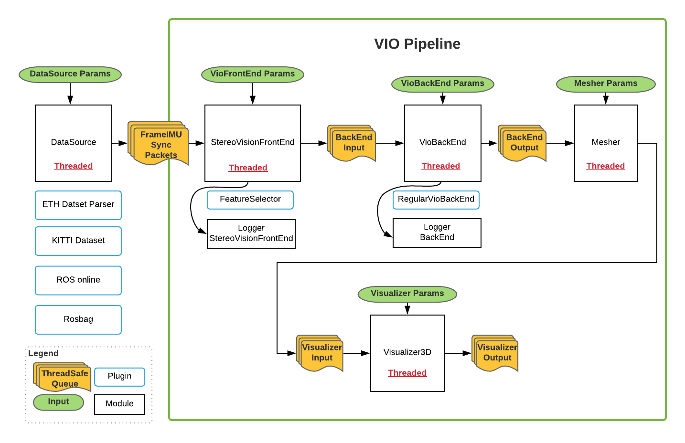
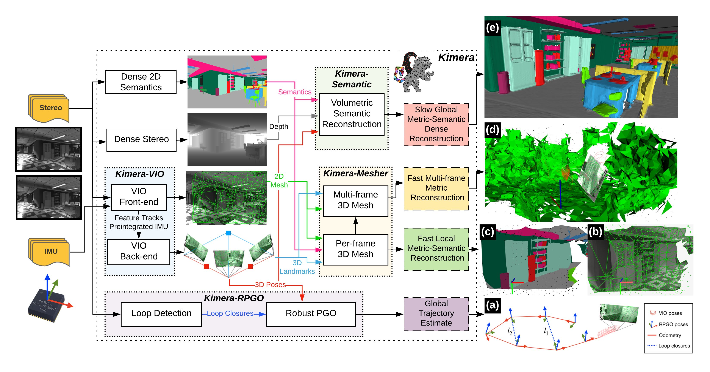

<div align="center">
  <a href="http://mit.edu/sparklab/">
    
  </a> 
  <a href="https://www.mit.edu/~arosinol/">
    
  </a> 
  <a href="https://mit.edu"> 
    
  </a>
</div>

# Kimera-VIO: Open-Source Visual Inertial Odometry

[](http://ci-sparklab.mit.edu:8080/job/MIT-SPARK-Kimera/job/master/)
For evaluation plots, check our [jenkins server](http://ci-sparklab.mit.edu:8080/job/MIT-SPARK-Kimera/job/master/VIO_20Euroc_20Performance_20Report/plots.html#V1_01_easy).

**Authors:** [Antoni Rosinol](https://www.mit.edu/~arosinol/), Yun Chang, Marcus Abate, Sandro Berchier, [Luca Carlone](https://lucacarlone.mit.edu/)

## What is Kimera-VIO?

Kimera-VIO is a Visual Inertial Odometry pipeline for accurate State Estimation from **Stereo** + **IMU** data. (Mono-only capabilities soon to be released).

## Publications

We kindly ask to cite our paper if you find this library useful:

 - A. Rosinol, M. Abate, Y. Chang, L. Carlone. [**Kimera: an Open-Source Library for Real-Time Metric-Semantic Localization and Mapping**](https://arxiv.org/abs/1910.02490). arXiv preprint [arXiv:1910.02490](https://arxiv.org/abs/1910.02490).
 ```bibtex
 @misc{Rosinol19arxiv-Kimera,
   title = {Kimera: an Open-Source Library for Real-Time Metric-Semantic Localization and Mapping},
   author = {Rosinol, Antoni and Abate, Marcus and Chang, Yun and Carlone, Luca},
   year = {2019},
   eprint = {1910.02490},
   archiveprefix = {arXiv},
   primaryclass = {cs.RO},
   url = {https://github.com/MIT-SPARK/Kimera},
   pdf = {https://arxiv.org/pdf/1910.02490.pdf}
 }
```

### Related Publications

Backend optimization is based on:

 - C. Forster, L. Carlone, F. Dellaert, and D. Scaramuzza. **On-Manifold Preintegration Theory for Fast and Accurate Visual-Inertial Navigation**. IEEE Trans. Robotics, 33(1):1-21, 2016.

 - L. Carlone, Z. Kira, C. Beall, V. Indelman, and F. Dellaert. **Eliminating Conditionally Independent Sets in Factor Graphs: A Unifying Perspective based on Smart Factors.** IEEE Intl. Conf. on Robotics and Automation (ICRA), 2014.

Alternatively, the `Regular VIO` backend, using structural regularities, is described in this paper:

- A. Rosinol, T. Sattler, M. Pollefeys, and L. Carlone. **Incremental Visual-Inertial 3D Mesh Generation with Structural Regularities**. IEEE Int. Conf. on Robotics and Automation (ICRA), 2019.

## Demo

<div align="center">
  
</div>

# 1. Installation

Tested on Mac, Ubuntu 14.04 & 16.04 & 18.04.

## Prerequisites

- [GTSAM](https://github.com/borglab/gtsam) >= 4.0
- [OpenCV](https://github.com/opencv/opencv) >= 3.3.1
- [OpenGV](https://github.com/laurentkneip/opengv)
- [Glog](http://rpg.ifi.uzh.ch/docs/glog.html), [Gflags](https://gflags.github.io/gflags/)
- [Gtest](https://github.com/google/googletest/blob/master/googletest/docs/primer.md) (installed automagically).
- [DBoW2](https://github.com/dorian3d/DBoW2)
- [Kimera-RPGO](https://github.com/MIT-SPARK/Kimera-RPGO)

> Note: if you want to avoid building all dependencies yourself, we provide a docker image that will install them for you. Check installation instructions in [docs/kimera_vio_install.md](./docs/kimera_vio_install.md).

> Note 2: if you use ROS, then [Kimera-VIO-ROS](https://github.com/MIT-SPARK/Kimera-VIO-ROS) can install all dependencies and Kimera inside a catkin workspace.

## Installation Instructions

Find how to install Kimera-VIO and its dependencies here: **[Installation instructions](./docs/kimera_vio_install.md)**.

# 2. Usage

## General tips

The LoopClosureDetector (and PGO) module is disabled by default. If you wish to run the pipeline with loop-closure detection enabled, set the `use_lcd` flag to true. For the example script, this is done by passing `-lcd` at commandline like so:
```bash
./scripts/stereoVIOEUROC.bash -lcd
```

To log output, set the `log_output` flag to true. For the script, this is done with the `-log` commandline argument. By default, log files will be saved in [output_logs](output_logs/).

To run the pipeline in sequential mode (one thread only), set `parallel_run`to false. This can be done in the example script with the `-s` argument at commandline.

## i. [Euroc](http://projects.asl.ethz.ch/datasets/doku.php?id=kmavvisualinertialdatasets) Dataset

#### Download Euroc's dataset

- Download one of Euroc's datasets, for example [V1_01_easy.zip](http://robotics.ethz.ch/~asl-datasets/ijrr_euroc_mav_dataset/vicon_room1/V1_01_easy/V1_01_easy.zip).

> Datasets MH_04 and V2_03 have different number of left/right frames. We suggest using instead [**our version of Euroc here**](https://drive.google.com/open?id=1_kwqHojvBusHxilcclqXh6haxelhJW0O).

- Unzip the dataset to your preferred directory, for example, in `~/Euroc/V1_01_easy`:
```bash
mkdir -p ~/Euroc/V1_01_easy
unzip -o ~/Downloads/V1_01_easy.zip -d ~/Euroc/V1_01_easy
```

#### Yamelize Euroc's dataset

Add `%YAML:1.0` at the top of each `.yaml` file inside Euroc.
You can do this manually or run the `yamelize.bash` script by indicating where the dataset is (it is assumed below to be in `~/path/to/euroc`):
> You don't need to yamelize the dataset if you download our version [here](https://drive.google.com/open?id=1_kwqHojvBusHxilcclqXh6haxelhJW0O)
```bash
cd Kimera-VIO
bash ./scripts/euroc/yamelize.bash -p ~/path/to/euroc
```

### Run Kimera-VIO in Euroc's dataset

Using a bash script bundling all command-line options and gflags:

```bash
cd Kimera-VIO
bash ./scripts/stereoVIOEuroc.bash -p "PATH_TO_DATASET/V1_01_easy"
```

> Alternatively, one may directly use the executable in the build folder:
`./build/stereoVIOEuroc`. Nevertheless, check the script `./scripts/stereoVIOEuroc.bash` to understand what parameters are expected, or check the [parameters](#Parameters) section below.

## ii. Using [ROS wrapper](https://github.com/MIT-SPARK/Kimera-VIO-ROS)

We provide a ROS wrapper of Kimera-VIO that you can find at: https://github.com/MIT-SPARK/Kimera-VIO-ROS.

This library can be cloned into a catkin workspace and built alongside the ROS wrapper.

## iii. Evalation and Debugging

For more information on tools for debugging and evaluating the pipeline, see [our documentation](/docs/kimera_vio_debug_evaluation.md)

# 3. Parameters
Kimera-VIO accepts two independent sources of parameters:
- YAML files: contains parameters for Backend and Frontend.
- [gflags](https://gflags.github.io/gflags/) contains parameters for all the rest.

To get help on what each gflag parameter does, just run the executable with the `--help` flag: `./build/stereoVIOEuroc --help`. You should get a list of gflags similar to the ones [here](./docs/gflags_parameters.md).

  - Optionally, you can try the VIO using structural regularities, as in [our ICRA 2019 paper](https://ieeexplore.ieee.org/abstract/document/8794456), by specifying the option ```-r```: ```./stereoVIOEuroc.bash -p "PATH_TO_DATASET/V1_01_easy" -r```

OpenCV's 3D visualization also has some shortcuts for interaction: check [tips for usage](./docs/tips_usage.md)

# 4. Contribution guidelines

We strongly encourage you to submit issues, feedback and potential improvements.
We follow the branch, open PR, review, and merge workflow.

To contribute to this repo, ensure your commits pass the linter pre-commit checks.
To enable these checks you will need to [install linter](./docs/linter_install.md).
We also provide a `.clang-format` file with the style rules that the repo uses, so that you can use [`clang-format`](https://clang.llvm.org/docs/ClangFormat.html) to reformat your code.

Also, check [tips for development](./docs/tips_development.md) and our **[developer guide](./docs/developer_guide.md)**.

# 5. FAQ
  If you have problems building or running the pipeline and/or issues with dependencies, you might find useful information in our [FAQ](./docs/faq.md) or in the issue tracker.

# 6. Chart





# 7. BSD License

Kimera-VIO is open source under the BSD license, see the [LICENSE.BSD](LICENSE.BSD) file.
